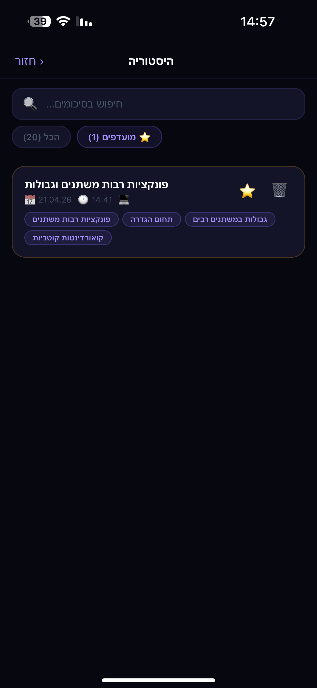
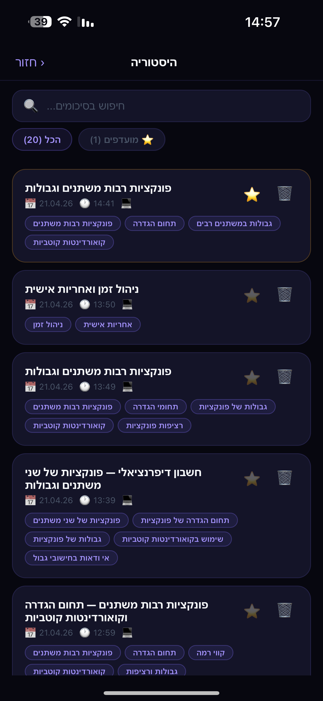
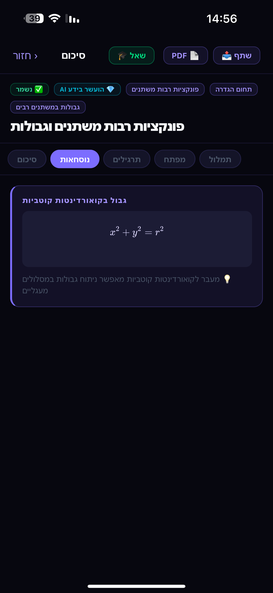
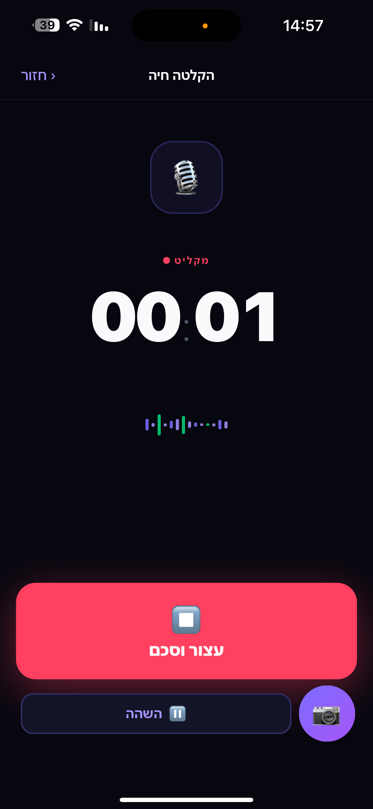
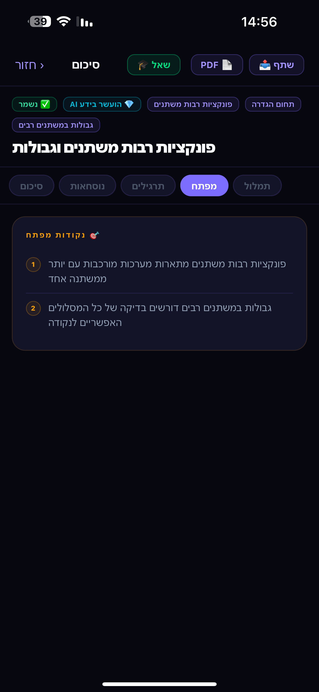

# 🎓 AcademicRescue AI

> Turn any lecture into a deep, structured study summary — powered by GPT-4o.

Built by a student, for students. AcademicRescue AI solves the hardest part of university: keeping up with fast-paced lectures and turning raw notes into material you can actually study from.

---

## ✨ Key Features

- 🎙️ **Record or upload** any lecture audio (MP3, M4A, WAV, MP4, up to 500MB)
- 🧠 **3-stage AI pipeline** — Whisper → GPT-4o enrichment → structured summary
- 📐 **Interactive math** — formulas rendered with KaTeX, graphs with Desmos
- 📑 **5 organized tabs** — Summary, Formulas, Exercises, Key Points, Transcript
- 💬 **Ask AI** — chat with GPT-4o about the specific lecture
- 📸 **Whiteboard OCR** — photograph the board and extract text
- 💾 **History & favorites** — save, rename, and star past summaries
- 📤 **PDF export & sharing** — share summaries with full math rendering
- 🌙 **Dark theme, RTL Hebrew UI** — built for Israeli university students

---

## 🛠️ Tech Stack

| Layer | Technology |
|---|---|
| Mobile app | React Native + Expo SDK 54 |
| UI | Custom dark theme, Animated API, expo-haptics |
| Math rendering | KaTeX (WebView) + Desmos API |
| Backend | FastAPI (Python) on Render |
| Speech-to-text | OpenAI Whisper |
| AI summarization | GPT-4o (json_object mode) |
| Storage | AsyncStorage (local) |
| Deployment | Render.com (auto-deploy from GitHub) |

---

## 🧠 How It Works — The 3-Stage AI Pipeline

```
┌─────────────────────────────────────────────────────────────┐
│                     AcademicRescue AI                       │
│                                                             │
│  📱 Mobile App (React Native)                               │
│  ┌────────────┐    ┌─────────────┐    ┌─────────────────┐  │
│  │ Record /   │───▶│  FastAPI    │───▶│   Results UI    │  │
│  │ Upload     │    │  /transcribe│    │  5 tabs + Ask   │  │
│  └────────────┘    └─────────────┘    └─────────────────┘  │
│                           │                                 │
│                    ┌──────▼──────┐                          │
│                    │  STAGE 1   │                           │
│                    │  Whisper   │  Speech → Hebrew text     │
│                    │  (OpenAI)  │  + timestamps             │
│                    └──────┬──────┘                          │
│                           │                                 │
│                    ┌──────▼──────┐                          │
│                    │  STAGE 2   │                           │
│                    │  GPT-4o    │  Expert enrichment:       │
│                    │  Enrich    │  analogies, insights,     │
│                    └──────┬──────┘  exam traps              │
│                           │                                 │
│                    ┌──────▼──────┐                          │
│                    │  STAGE 3   │                           │
│                    │  GPT-4o    │  Structured JSON:         │
│                    │  Summarize │  sections, formulas,      │
│                    └─────────────┘  exercises, key points   │
└─────────────────────────────────────────────────────────────┘
```

### Stage 1 — Whisper Transcription
The audio is sent to OpenAI Whisper with Hebrew language hints. For files over 24MB, the server automatically splits the audio into chunks using `ffmpeg`, transcribes each chunk, and merges the results with correct timestamps.

### Stage 2 — GPT-4o Expert Enrichment
A "professor" prompt analyzes the transcript and generates deep enrichment: better explanations, real-world analogies, common mistakes, deeper insights, and exam traps — things the lecturer didn't say.

### Stage 3 — GPT-4o Structured Summary
A "best teacher in the world" prompt combines the transcript and enrichment into a fully structured JSON summary with typed sections: `big_picture`, `concept`, `formula`, `exercise`, `mental_model`, `missed_by_lecturer`, `exam_traps`.

---

## 📱 Screenshots

| Home | Summary | Formulas | Exercises | Ask AI |
|------|---------|----------|-----------|--------|
|  |  |  |  |  |

---

## 🏗️ Architecture

```
AcademicRescue/
├── AcademicRescueApp/       # React Native (Expo)
│   ├── App.js               # Main app (~1100 lines) — recording, results, history
│   └── AskScreen.js         # Chat UI for asking about the lecture
│
└── AcademicRescueWeb/       # Python backend
    └── server.py            # FastAPI — /transcribe, /summarize, /chat, /ocr, /health
```

**Live backend:** `https://academic-rescue-ai.onrender.com`

---

## 🚀 Setup

### Backend

```bash
cd AcademicRescueWeb
pip install fastapi uvicorn httpx python-multipart
export OPENAI_API_KEY=sk-...
uvicorn server:app --reload
```

### Mobile App

```bash
cd AcademicRescueApp
npm install
npx expo start --clear --lan
```

Scan the QR code with **Expo Go** on your phone.

> **Note:** The app points to the live Render backend by default. To use a local server, update the `API_BASE` constant in `App.js`.

---

## 🔌 API Endpoints

| Endpoint | Method | Description |
|----------|--------|-------------|
| `/health` | GET | Server status |
| `/transcribe` | POST | Audio → Hebrew transcript (Whisper) |
| `/summarize` | POST | Transcript → structured JSON summary (GPT-4o) |
| `/chat` | POST | Ask a question about the lecture (GPT-4o) |
| `/ocr` | POST | Whiteboard image → extracted text (GPT-4o Vision) |

---

## 💡 What I Learned

This project pushed me across the full stack:

- **Prompt engineering** — designing multi-stage GPT-4o pipelines that return consistent structured JSON
- **Mobile development** — React Native gestures, animations, WebView rendering, PDF generation
- **Backend architecture** — async FastAPI, rate limiting, audio chunking, error recovery
- **Production deployment** — Render.com, environment variables, CORS, timeout handling
- **Math rendering** — integrating KaTeX and Desmos inside React Native WebViews

---

## 👤 Author

Built with ❤️ by a Computer Science student who was tired of bad lecture notes.

`#ReactNative` `#AI` `#OpenAI` `#Python` `#FastAPI` `#MobileApp` `#Portfolio` `#StudentProject`
